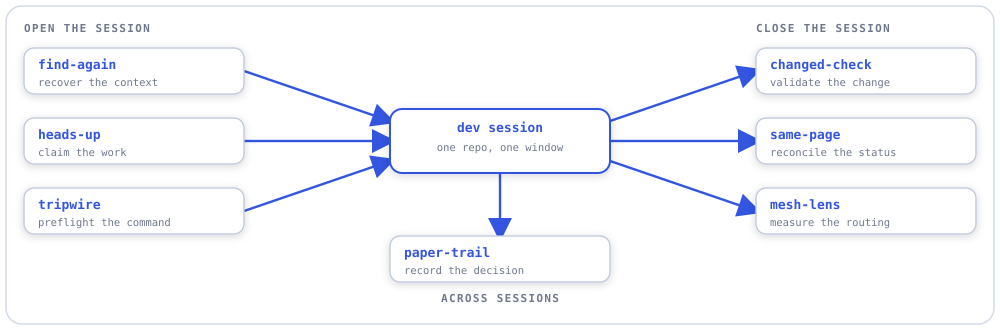

# mesh-lens

A local-first utility for explicit **Skill Mesh telemetry analysis**. It normalizes skill/model
dispatch records and downstream outcome evidence, then reports comparable cohorts by skill, model,
project, and task type with provenance, missing-data warnings, and sample-size limits. It *measures*
routing outcomes but never changes routing.

## Stack

| Tool | Why |
|---|---|
| Python 3.12+ | Implementation language |
| uv | Environment + dependency management |
| argparse | CLI |
| pytest | Frozen-telemetry, join, aggregate-golden, and cohort tests |
| Ruff | Lint + format |
| mypy (strict) | Static typing |

## Prerequisites

- Python 3.12+
- [uv](https://docs.astral.sh/uv/)

## Setup

```bash
uv sync --extra dev
uv run pytest -q
uv run ruff check .
uv run mypy --strict src
```

## Usage

```bash
mesh-lens ingest    # normalize the Skill Mesh JSONL stream + available outcome artifacts
mesh-lens report    # aggregate report by comparable cohorts (static HTML/JSON)
mesh-lens compare   # guarded pairwise cohort comparison
```

## Input contract

Skill Mesh appends one JSON object per dispatch to `.claude/lib/telemetry/invocations.jsonl` (UTF-8,
no BOM, append-only). Mesh Lens consumes the pinned **eight-field** producer format
(`timestamp`, `skill`, `model`, `tokens_in`, `tokens_out`, `latency_ms`, `cost_usd`, `verdict`) as a
**format contract** — any substitute producer emitting the same format is analyzed identically. An
absent or empty stream degrades gracefully (zero records, report says so; never an error).

## Design decisions

- **Inventory before schema expansion.** Phase 1 records which desired fields exist, are derivable,
  or are absent; missing fields stay missing rather than getting success-shaped defaults.
- **Producer/analyst separation.** Mesh Lens reads Skill Mesh contracts and owns normalized
  analytics; it never becomes the router or writes back routing decisions.
- **Comparison requires cohorts.** Reports stratify by skill, pinned model, project, task type, and
  schema version. Incomparable records are never merged into one rate.
- **Correlation only.** Reports state sample size, missingness, and confounds; decision-changing
  metrics must be defined before looking at the comparison.
- **Record identity.** A normalized record's ID is its source-provenance ref
  `<source-relpath>@<line-number>` plus a stored SHA-256 `content_hash` of the raw line (pure
  content-hash is not viable — stub records zero all token/cost fields). Re-ingest is idempotent via
  a per-source byte-offset checkpoint with hash-verify.
- **Producer schema by inference.** `producer_schema="skillmesh-v1"` only when a record's field set
  exactly matches the pinned eight-field contract; any other field set lands in an `unknown` cohort,
  reported incomparable. Store records carry their own `schema_version: 1`.

## Project structure

```
src/mesh_lens/
  models.py      normalized invocation / outcome / cohort / provenance shapes
  inventory.py   producer/artifact availability audit
  adapters/      Skill Mesh JSONL + downstream result readers
  store.py       append-only normalized local event/result files
  analyze.py     grouping, missingness, comparison rules
  render.py      static HTML + JSON reports
  cli.py         ingest / report / compare
```

See [plans/plan.md](plans/plan.md) for the producer schema table and outcome-artifact classes.

## Sibling utilities

<picture>
  <source media="(prefers-color-scheme: dark)" srcset="assets/utility-family-dark.svg">
  
</picture>

One of seven local-first utilities for a dev workspace. Each is a standalone CLI with no shared
runtime and no cross-imports; where two of them meet, the seam is a file-format contract, so any
one of them can be replaced without touching the others.

- [find-again](https://github.com/aberson/find-again) - local full-text search across dev-memory artifacts
- [heads-up](https://github.com/aberson/heads-up) - advisory expiring claims across parallel sessions
- [tripwire](https://github.com/aberson/tripwire) - preflight checks on repo state and commands
- [changed-check](https://github.com/aberson/changed-check) - narrowest declared validation for a change set
- [same-page](https://github.com/aberson/same-page) - deterministic contradiction detection across status artifacts
- [mesh-lens](https://github.com/aberson/mesh-lens) - cohort analysis of skill and model telemetry (you are here)
- [paper-trail](https://github.com/aberson/paper-trail) - immutable decision records with explicit supersession

More at [github.com/aberson](https://github.com/aberson) and [aberson.github.io](https://aberson.github.io).
